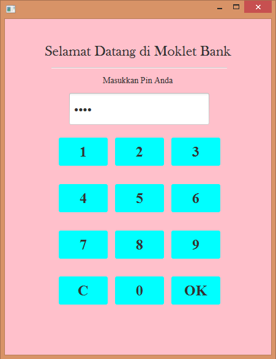
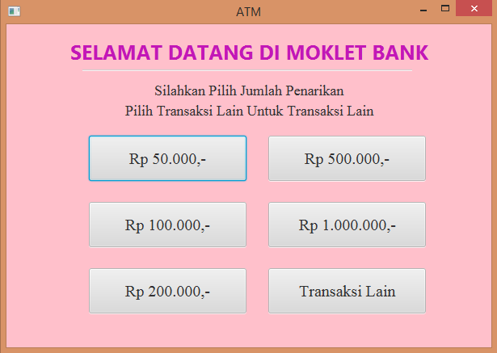

# Modul7JavaFX_ATM2

Ketika Program dijalankan maka akan mengeluarkan tampilan seperti gambar di atas.

Setelah itu, kita bisa menginputkan pin yang sudah kita atur sebelumnya di dalam program.

Setelah kita menekan oke maka output yang ditampilkan adalah

